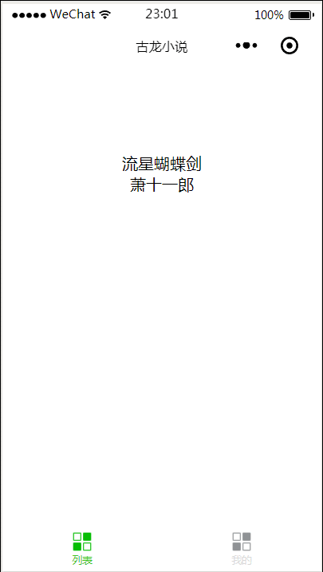

# GuLong
花了两晚上从零开始写的具有书签功能的古龙小说阅读器。

## 微信查看：

## 效果展示：

## 目前有几个bug:

1. 不知道为什么在每次跳转的时候tabBar的另一个页面总是会显示出来。
2. 数据储存问题，自己买了腾讯云但是没事件搭建，微信又不支持github域名，所以只好把数据写在js文件里面，每次运行时读取js文件。

## 以后可能会做：

1. 优化界面。
2. 数据从自己的腾讯云服务器读取。
3. “我的”这个tabBar的开发。
4. 目录。
